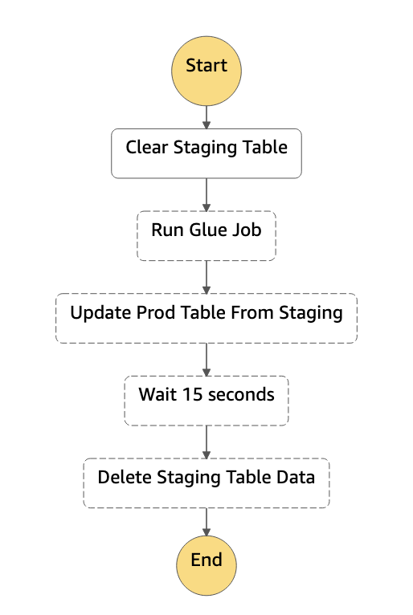

# CloudFormation Template: Glue Job to Pull Data from Staging to Prod
This artifact comprises a CloudFormation template to:

* Deploy a Step Function
* That Step Function:
  * runs a Glue Job (which pulls S3 data into a staging table)
  * runs a Lambda function to clear prod table
  * runs another Lambda function to move staging data into prod
  * runs another Lambda function to clear the staging table



## Quick Start

Use pip 21 for Python 3.9.

1. Install PyMySQL into _each_ Lambda function's directory (to include as part of the Lambda deployment package).
   
   ```bash
   # Execute from the root directory of this project

   # Install PyMySQL into updateProdFromStagingTable
   pip install \
       -r lambdas/updateProdFromStagingTable/requirements.txt \
       --target lambdas/updateProdFromStagingTable/

   # Install PyMySQL into deleteStagingTableData
   pip install \
        -r lambdas/deleteStagingTableData/requirements.txt \
        --target lambdas/deleteStagingTableData/

   # Install PyMySQL into deleteProdTableData
   pip install \
        -r lambdas/deleteProdTableData/requirements.txt \
        --target lambdas/deleteProdTableData/
   ```

2. (Optional) Create a bucket for putting the Lambda deployment package zips into.

   ```bash
   aws cloudformation create-stack \
       --stack-name step-function-lambda-zips-bucket \
       --template-body file://Create-S3-Bucket-for-Lambda.yml
   ```

3. Package and deploy the Lambda deployment packages.
   ```bash
   # Get the bucket name
   aws cloudformation describe-stacks --stack-name step-function-lambda-zips-bucket --query "Stacks[0].Outputs[0].OutputValue" --output text

   # Push the Lambda deployment packages to S3 and generate a new CloudFormation template

   # If you created the bucket in step 2 above
   LAMBDA_ZIPS_S3_BUCKET=$(aws cloudformation describe-stacks \
       --stack-name step-function-lambda-zips-bucket \
       --query "Stacks[0].Outputs[0].OutputValue" \
       --output text)
       aws cloudformation package \
       --s3-bucket $LAMBDA_ZIPS_S3_BUCKET \
       --template-file Dash-Step-Functions-Template.yml \
       --output-template-file Step-Functions.yml

   # If you'd rather use an existing bucket for your Lambda deployment packages
   LAMBDA_ZIPS_S3_BUCKET=<your-bucket-name>
       aws cloudformation package \
       --s3-bucket $LAMBDA_ZIPS_S3_BUCKET \
       --template-file Dash-Step-Functions-Template.yml \
       --output-template-file Step-Functions.yml
   ```

<!-- 4. Create a Lambda executor role, if one doesn't already exist. At a minimum, the role needs the following policies attached:
   
   * `AWSLambdaBasicExecutionRole`
   * `AWSStepFunctionsFullAccess`
   
   Once you have created the role, pass the role ARN to the command line as the
   `StepFunctionRoleArn` parameter (or just update the CloudFormation template). -->

4. Deploy the Step Functions stack.
   
   ```bash
   aws cloudformation create-stack \
       --stack-name step-function-csat \
       --template-body file://Step-Functions.yml \
       --parameters ParameterKey=GlueJobName,ParameterValue=staging-csat \
       --capabilities CAPABILITY_IAM
   ```

5. Once the stack has created, head to Step Functions and start execution of the Step Function.
   
   You should provide `TableName` when triggering the execution so it can be passed to the Lambda functions. For example, provider the following JSON when starting execution of the Step Function:

   ```json
   {
       "TableName": "your_table_name"
   }
   ```

## Common Commands

### Update Stack
```bash
aws cloudformation update-stack \
       --stack-name step-function-csat \
       --template-body file://Step-Functions.yml \
       --parameters ParameterKey=GlueJobName,ParameterValue=staging-csat \
       --capabilities CAPABILITY_IAM
```

### Delete Stack
```bash
aws cloudformation delete-stack --stack-name step-function-csat
```

### Validate Stack
```bash
aws cloudformation validate-template --template-body file://Dash-Step-Functions-Template.yml
```


# Troubleshooting
If your stack fails to deploy, it may roll back and end up in the state `ROLLBACK_COMPLETE`. If this happens, you won't be able to create a new stack with the same name, nor will you be able to update the existing stack.

Instead, you will need to:

1. Delete the rolled back stack.
   ```bash
   aws cloudformation delete-stack --stack-name step-function-csat
   ```
2. Create a new stack.
   
   (See above).

# License
See [LICENSE](LICENSE).
